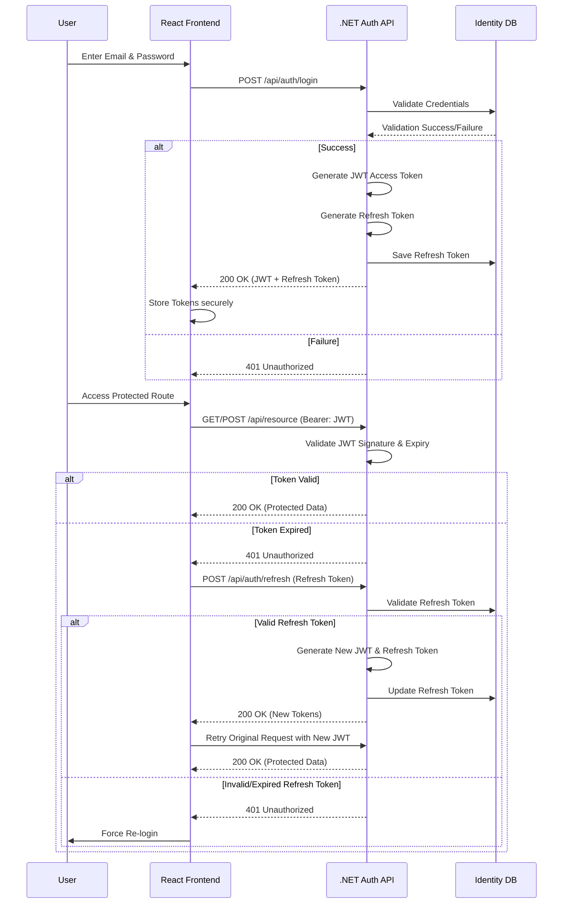

# Authentication Flow Chart

The system implements a secure authentication flow utilizing JWT (JSON Web Tokens) for access control and sliding expiration via rotating refresh tokens.

```mermaid
sequenceDiagram
    participant User
    participant React Frontend
    participant .NET Auth API
    participant Identity DB

    %% Login Flow
    User->>React Frontend: Enter Email & Password
    React Frontend->>.NET Auth API: POST /api/auth/login
    .NET Auth API->>Identity DB: Validate Credentials
    Identity DB-->>.NET Auth API: Validation Success/Failure
    
    alt Success
        .NET Auth API->>.NET Auth API: Generate JWT Access Token
        .NET Auth API->>.NET Auth API: Generate Refresh Token
        .NET Auth API->>Identity DB: Save Refresh Token
        .NET Auth API-->>React Frontend: 200 OK (JWT + Refresh Token)
        React Frontend->>React Frontend: Store Tokens securely
    else Failure
        .NET Auth API-->>React Frontend: 401 Unauthorized
    end

    %% Protected API Call
    User->>React Frontend: Access Protected Route
    React Frontend->>.NET Auth API: GET/POST /api/resource (Bearer: JWT)
    .NET Auth API->>.NET Auth API: Validate JWT Signature & Expiry
    
    alt Token Valid
        .NET Auth API-->>React Frontend: 200 OK (Protected Data)
    else Token Expired
        .NET Auth API-->>React Frontend: 401 Unauthorized
        
        %% Refresh Token Flow
        React Frontend->>.NET Auth API: POST /api/auth/refresh (Refresh Token)
        .NET Auth API->>Identity DB: Validate Refresh Token
        
        alt Valid Refresh Token
            .NET Auth API->>.NET Auth API: Generate New JWT & Refresh Token
            .NET Auth API->>Identity DB: Update Refresh Token
            .NET Auth API-->>React Frontend: 200 OK (New Tokens)
            React Frontend->>.NET Auth API: Retry Original Request with New JWT
            .NET Auth API-->>React Frontend: 200 OK (Protected Data)
        else Invalid/Expired Refresh Token
            .NET Auth API-->>React Frontend: 401 Unauthorized
            React Frontend->>User: Force Re-login
        end
    end
```
