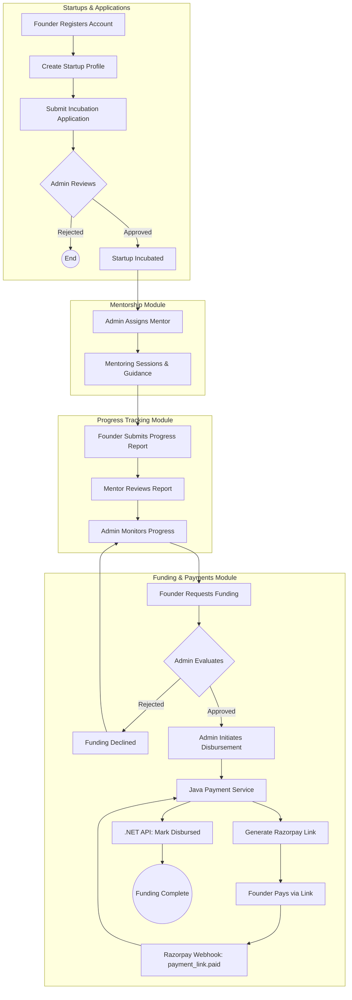

# All Module Flow Chart

This flowchart details the overarching lifecycle of a Startup within the Incubation Management System, traversing through multiple core modules from Application to Funding.

