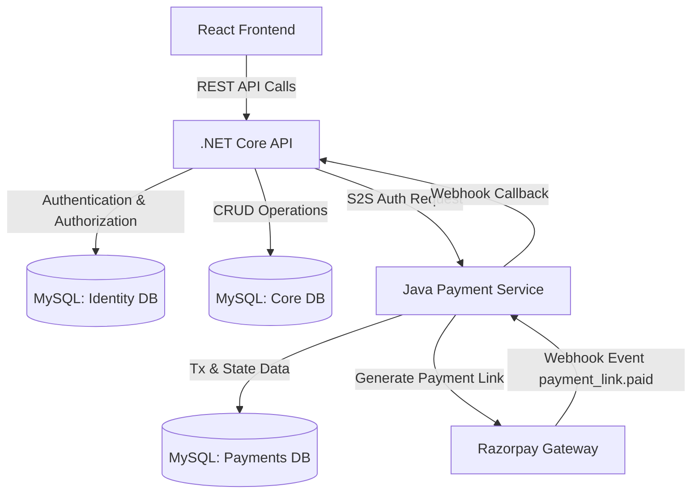

# Project Workflow

The following flowchart illustrates how the React Frontend, .NET Backend API, and Java Payment Service interact to fulfill requests within the Startup Incubation Management System.

### Key Interactions:
1. **Frontend to Backend**: All user interactions (Admin, Mentor, Founder) are routed through the .NET Core API.
2. **Backend to DB**: The backend is split into two contexts: `IdentityDbContext` for users and `CoreDbContext` for business data.
3. **Backend to Payment Service**: When an Admin approves funding, the .NET API calls the Java Payment Service securely via a shared Service-Key.
4. **Payment Service to Razorpay**: The Java service acts as the bridge to Razorpay, generating test payment links and handling webhook callbacks.
