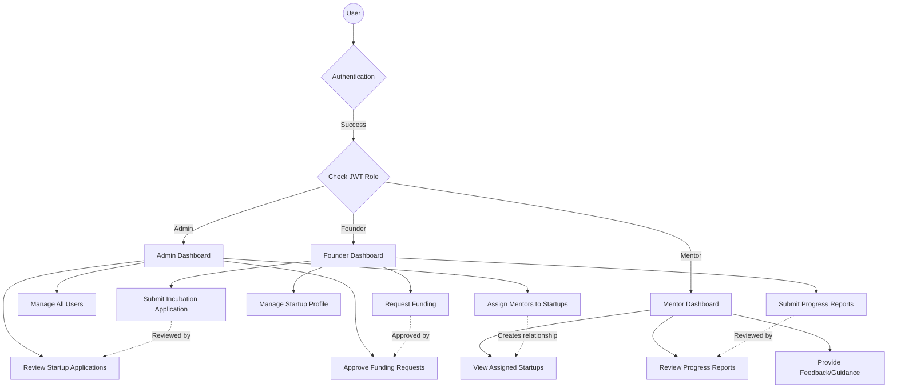

# Independent Role Based Flow

The system features robust role-based access control supporting three independent flows: **Admin**, **Mentor**, and **Founder**.

```mermaid
graph TD
    User((User)) --> Login{Authentication}
    Login -->|Success| RoleCheck{Check JWT Role}
    
    %% Role Branching
    RoleCheck -->|Admin| AdminFlow[Admin Dashboard]
    RoleCheck -->|Mentor| MentorFlow[Mentor Dashboard]
    RoleCheck -->|Founder| FounderFlow[Founder Dashboard]
    
    %% Admin Flow
    AdminFlow --> Adm1[Manage All Users]
    AdminFlow --> Adm2[Review Startup Applications]
    AdminFlow --> Adm3[Approve Funding Requests]
    AdminFlow --> Adm4[Assign Mentors to Startups]
    
    %% Mentor Flow
    MentorFlow --> Men1[View Assigned Startups]
    MentorFlow --> Men2[Review Progress Reports]
    MentorFlow --> Men3[Provide Feedback/Guidance]
    
    %% Founder Flow
    FounderFlow --> Fnd1[Manage Startup Profile]
    FounderFlow --> Fnd2[Submit Incubation Application]
    FounderFlow --> Fnd3[Submit Progress Reports]
    FounderFlow --> Fnd4[Request Funding]
    
    %% Interactions
    Fnd2 -.->|Reviewed by| Adm2
    Adm4 -.->|Creates relationship| Men1
    Fnd3 -.->|Reviewed by| Men2
    Fnd4 -.->|Approved by| Adm3
```
