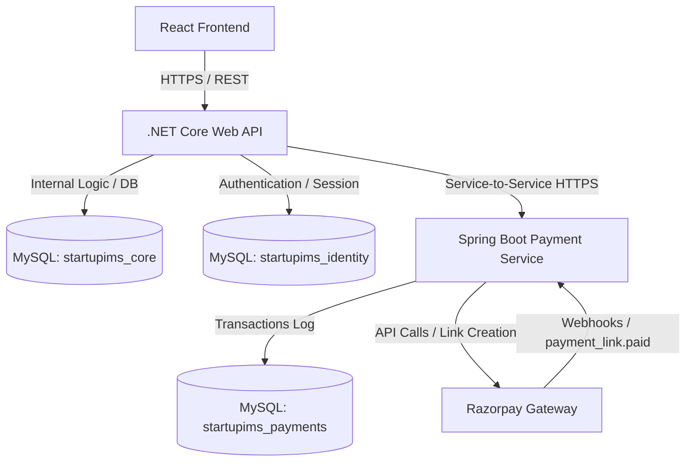
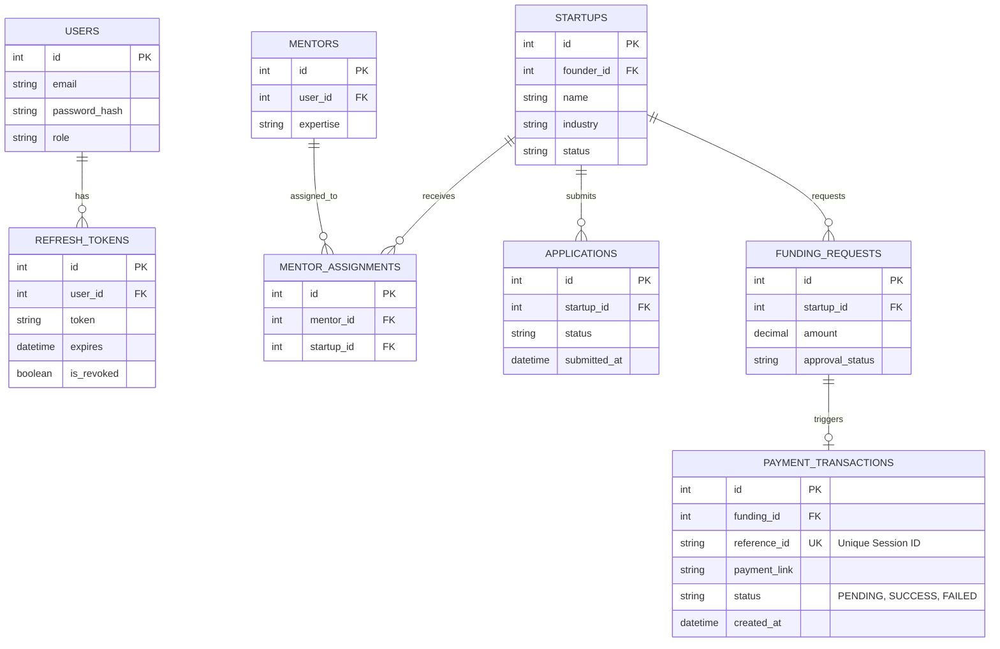

# System Design Document

This document outlines the system architecture, component breakdown, database design, and security strategies for the Startup Incubation Management System (StartupIMS).

---

## 1. High-Level Architecture

StartupIMS is designed as a polyglot microservice-oriented architecture consisting of:
1. **Frontend Client**: SPA React Application using Vite.
2. **Core Backend (Modular Monolith)**: ASP.NET Core 8 Web API which contains logically separated modules for Identity, Startups, Mentors, and Applications.
3. **Payment Service (Microservice)**: Spring Boot (Java) service for handling payment gateway integrations (Razorpay).

---

## 2. Component breakdown

### A. React Frontend Client
- **Purpose**: Interactive User Interface for Founders, Mentors, and Admins.
- **Tech Stack**: React 18, Vite, Tailwind CSS / Vanilla CSS, Axios.
- **Communication**: Communicates via REST APIs with the .NET Core API.

### B. Core Backend (.NET Modular Monolith)
- **Purpose**: Core business logic, domain validation, and user management.
- **Data Isolation**: 
  - Uses two DbContexts (`IdentityDbContext` and `CoreDbContext`) sharing a single MySQL database instance but pointing to separate database schemas (`startupims_identity` and `startupims_core`).
  - This ensures that if the Identity service needs to be extracted into a separate service later, there are no hard foreign key constraints or EF navigation properties crossing the boundary.
- **Authentication**: JWT token issuance and rotating refresh token management.

### C. Payment Service (Java Microservice)
- **Purpose**: Isolates the payment gateway logic and billing rules.
- **Tech Stack**: Java 17, Spring Boot, Spring Data JPA, Razorpay SDK.
- **Callback Loop**: Razorpay alerts the microservice via webhooks on transaction status shifts, which then informs the Core Backend to update funding request tables.

---

## 3. Database Schema Design

---

## 4. Security & Authentication Model

### User Authentication (JWT)
1. **Access Tokens**: Short-lived (e.g., 15 minutes) JWT tokens containing user identity and roles (`Founder`, `Mentor`, `Admin`).
2. **Refresh Tokens**: Long-lived rotating tokens stored in the browser (HttpOnly cookies or secure client storage) and updated upon every refresh request to prevent replay attacks.

### Service-to-Service (S2S) Security
Direct communication between the **.NET Core API** and the **Java Payment Service** is secured using a simple API-Key authorization scheme instead of user-level JWTs:
- **Outbound API Key**: .NET signs headers with `X-Service-Key` to hit the `/api/payments/initiate` endpoint on Java.
- **Inbound API Key**: Java signs headers with a service key when posting callback results to the `.NET` webhooks.

### Webhook Verification
- Webhook endpoints exposed to Razorpay verify the authenticity of the incoming request by verifying Razorpay's cryptographic signature (`Utils.verifyWebhookSignature`) using the shared Webhook Secret.

---

## 5. Deployment Architecture

Containerization details are implemented using Docker:
- **Dockerfile (Backend)**: Multi-stage build for building and executing the .NET application.
- **Dockerfile (Payment Service)**: Multi-stage build utilizing Maven for compilation and running the jar file.
- **Docker Compose**: Automatically orchestrates the MySQL containers alongside the frontend, backend, and payment services, mapping networks for secure S2S communications.
